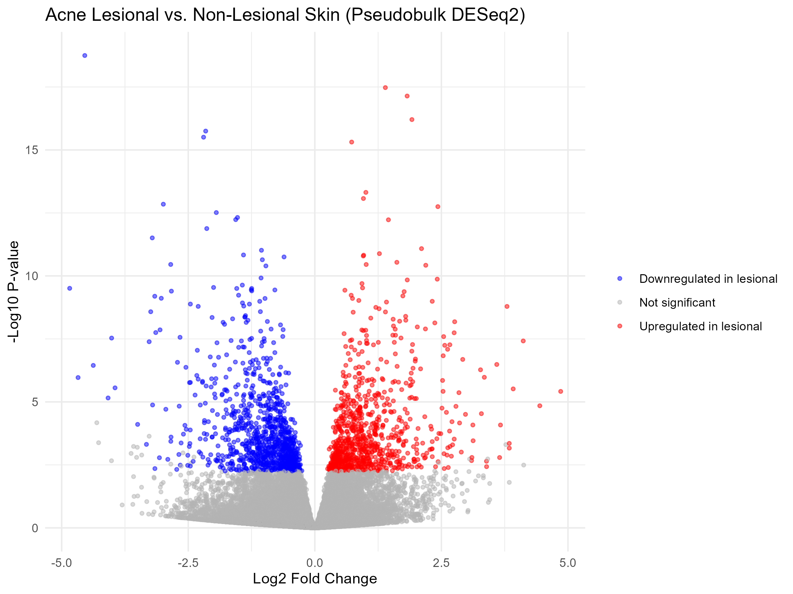
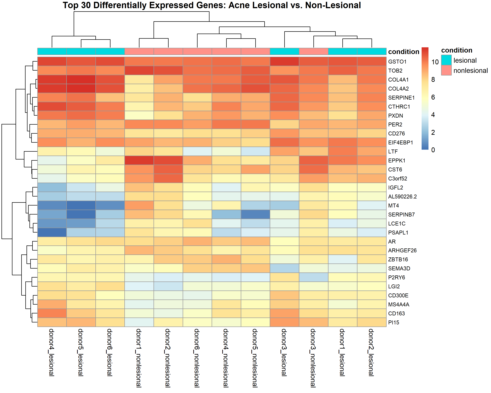
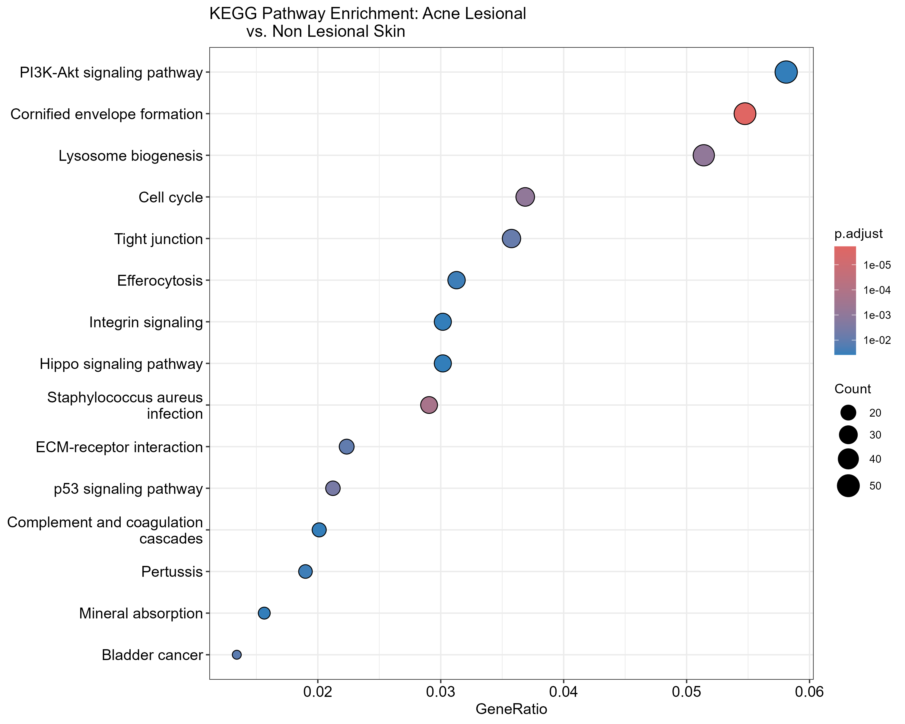
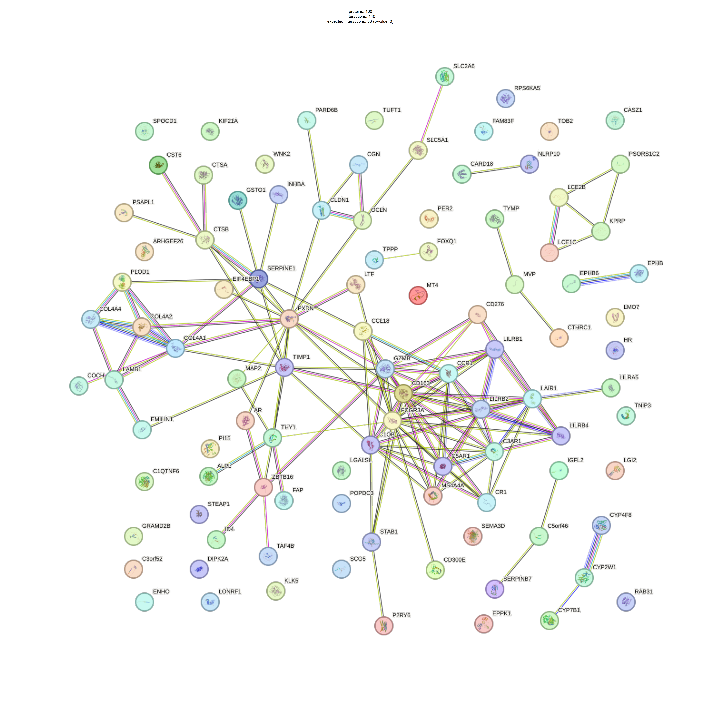

# Acne Transcriptomics Differential Expression Analysis

## Problem

Acne vulgaris is an inflammatory skin condition involving changes in immune activity, epidermal biology, and tissue structure. Understanding the genes and biological pathways that differ between acne lesions and non-lesional skin can provide insight into the molecular processes associated with the disease.

Publicly available acne transcriptomic datasets are relatively limited, particularly datasets containing suitable paired samples for differential expression analysis. This project therefore uses a publicly available single-cell RNA-seq dataset and aggregates the cell-level counts to the donor level to create pseudobulk samples.

The analysis compares lesional and non-lesional skin from the same six acne patients, allowing differences between individual donors to be accounted for during differential expression analysis.

## Approach

### 1. Dataset

The analysis uses GSE175817 from the NCBI Gene Expression Omnibus (GEO).

The dataset contains 10X Genomics single-cell RNA-seq data from six acne patients, with lesional and non-lesional skin samples available for each donor.

**Why single-cell data, and why not a microarray dataset:** well-established public acne datasets such as GSE108110 are microarray data rather than RNA-seq, meaning they report probe intensities rather than sequencing read counts. DESeq2 is designed for count-based RNA-seq data, using a negative binomial model and size-factor normalisation. Rather than applying DESeq2 inappropriately to microarray intensities, this project uses sequencing-based single-cell data and aggregates it into donor-level pseudobulk samples. This provides count data suitable for DESeq2 while retaining the paired acne-lesion design.

Rather than treating individual cells as independent biological replicates, cells were aggregated within each donor and condition to generate donor-level pseudobulk samples. This avoids pseudo-replication, where thousands of cells from the same individual would otherwise be incorrectly treated as independent biological replicates which is a well-documented statistical pitfall in single-cell differential expression (Squair et al., 2021, *Nature Communications*, "Confronting false discoveries in single-cell differential expression").

This produced:
- 6 donors
- 2 conditions per donor
- 12 pseudobulk samples
- approximately 29,000 genes

### 2. Pseudobulk preparation

For each donor, lesional and non-lesional cell counts were identified from the supplied count matrices.

Counts were summed separately across cells for each condition, producing one lesional and one non-lesional pseudobulk sample per donor.

### 3. Differential expression analysis

Differential expression analysis was performed using DESeq2.

The experimental design was:

```
~ donor + condition
```

Including donor in the design accounts for the paired nature of the samples while testing the effect of lesional versus non-lesional condition.

Genes were considered significantly differentially expressed using an adjusted p-value < 0.05.

### 4. Visualisation

The differential expression results were visualised using a volcano plot and a heatmap of the top 30 significant genes (by adjusted p-value).

### 5. Pathway enrichment

Significant genes were converted to Entrez Gene IDs and analysed using KEGG pathway enrichment with clusterProfiler.

### 6. Protein interaction analysis

Significant genes were also analysed using STRINGdb to investigate known and predicted protein-protein interactions.

## Results

The analysis identified **1,879 significantly differentially expressed genes** between lesional and non-lesional skin at adjusted p-value < 0.05: 882 upregulated and 997 downregulated in lesional skin.

### Differential expression

The volcano plot demonstrated substantial transcriptional differences between lesional and non-lesional skin.



The heatmap of the top 30 significant genes (selected by lowest adjusted p-value) showed some clustering by condition. Donors 4, 5, and 6 grouped clearly by lesional/non-lesional status, but the separation was not complete across all donors. Donor 3's two samples clustered adjacent to each other rather than with their respective condition groups. See Limitations for discussion.



### KEGG pathway enrichment

Enriched pathways included PI3K-Akt signalling, cornified envelope formation, lysosome biogenesis, cell cycle, tight junction, efferocytosis, integrin signalling, Hippo signalling, ECM-receptor interaction, and complement and coagulation cascades.

Cornified envelope formation was among the most statistically significant enriched pathways, with an adjusted p-value of approximately 1.9 × 10⁻⁶.



### STRING protein interaction analysis

The STRING network of the top 100 significant genes contained 140 observed interactions versus ~33 expected (p < 0.001), indicating significant network enrichment.

A prominent immune/macrophage-associated cluster included CD163, FCGR3A, C1QB, LILRB1, LILRB2, LILRB4, C3AR1, C5AR1, CCR1, and GZMB.

A separate extracellular matrix/tissue structure cluster included COL4A1, COL4A2, COL4A4, LAMB1, PLOD1, and EMILIN1.



## Interpretation

**1. Epidermal and barrier biology.** The enrichment of cornified envelope formation and tight junction pathways suggests alterations in epidermal differentiation and skin-barrier function relevant to acne given the epidermis's role as a physical barrier, and given that altered keratinisation is thought to contribute to pore blockage.

**2. Immune-associated activity.** The STRING network's macrophage/immune gene cluster is consistent with increased immune-associated transcriptional signatures in acne lesions. However, because this analysis uses all-cell pseudobulk data, it cannot distinguish whether individual cells show increased expression versus whether differences in cell-type composition between conditions drive the signal.

**3. Tissue structure and remodelling.** Extracellular matrix genes (COL4A1, COL4A2, LAMB1, PLOD1) and related pathway enrichment suggest active tissue remodelling in lesional skin.

Together, these results point to a combination of altered epidermal/barrier biology, immune activity, and extracellular matrix remodelling in acne lesions, rather than inflammation alone.

## Limitations

**1. Pseudobulk rather than true bulk RNA-seq.** This analysis aggregates single-cell data into donor-level pseudobulk samples rather than using a conventional bulk RNA-seq experiment. This avoids pseudo-replication but sacrifices the cell-type-specific resolution available in the original single-cell data.

**2. Cell composition effects.** Because pseudobulk samples combine multiple cell populations, differences in cell-type composition between lesional and non-lesional skin could contribute to observed differential expression for example, apparent upregulation of macrophage-associated genes could reflect a higher proportion of macrophages in lesional tissue rather than increased expression per cell.

**3. Small number of biological replicates.** Only six donors were available. The paired design accounts for donor-level variation, but a larger cohort would improve statistical power and generalisability.

**4. Count rounding.** Aggregated pseudobulk counts were non-integer (reflecting that the source data had already undergone ambient RNA decontamination) and were rounded before DESeq2 analysis, since DESeq2 requires integer input. This is a practical preprocessing step, but it represents a deviation from the original non-integer values (raw sequencing counts).

**5. Heatmap clustering was incomplete.** The top 30 genes shown in the heatmap were selected by statistical confidence (lowest adjusted p-value), not effect size. Small but highly consistent differences can produce very low p-values without necessarily producing a visually dramatic separation between conditions, and individual donor identity can influence clustering alongside the condition effect. As a result, not all donors' samples clustered cleanly by lesional/non-lesional status on the heatmap, even though the full DESeq2 analysis identified a substantial number of statistically significant genes.

**6. Pathway name interpretation.** Some enriched KEGG pathways carry disease-specific names (e.g., "Bladder cancer," "Pertussis") that reflect the context in which the underlying gene sets were first characterized, not literal evidence of those diseases. These pathway labels should be interpreted as describing shared underlying biology (e.g., cell-cycle or immune-signaling genes), not direct disease associations.

## Tools and Technologies

R, Bioconductor, GEOquery, DESeq2, clusterProfiler, STRINGdb, ggplot2, pheatmap, NCBI GEO, KEGG, STRING

## Project Outputs

- `volcano_plot.png` - differential expression volcano plot
- `heatmap_top30.png` - heatmap of the top 30 significant genes
- `kegg_dotplot.png` - KEGG pathway enrichment analysis
- `string_network_top100.png` - STRING protein-protein interaction network
- `acne_pseudobulk_deseq2.R` - full analysis script, from pseudobulk generation through differential expression, pathway enrichment, and protein interaction analysis

## Repository Structure

```
acne-transcriptomics-dge/
│
├── README.md
├── acne_pseudobulk_deseq2.R
│
├── volcano_plot.png
├── heatmap_top30.png
├── kegg_dotplot.png
└── string_network_top100.png
```

Raw GEO data are not included in the repository. The dataset can be obtained from NCBI GEO using accession GSE175817.

## Project Outcome

This project demonstrates a complete transcriptomic analysis workflow using public biological data:

scRNA-seq count data → donor-level pseudobulk → paired differential expression → visualisation → pathway enrichment → protein interaction analysis

The project demonstrates practical experience with R, DESeq2, Bioconductor, GEO data, differential expression analysis, pathway enrichment, protein interaction analysis, and biological interpretation including reasoned methodological trade-offs (choosing pseudobulk RNA-seq over microarray data) and honest reporting of the resulting limitations.
